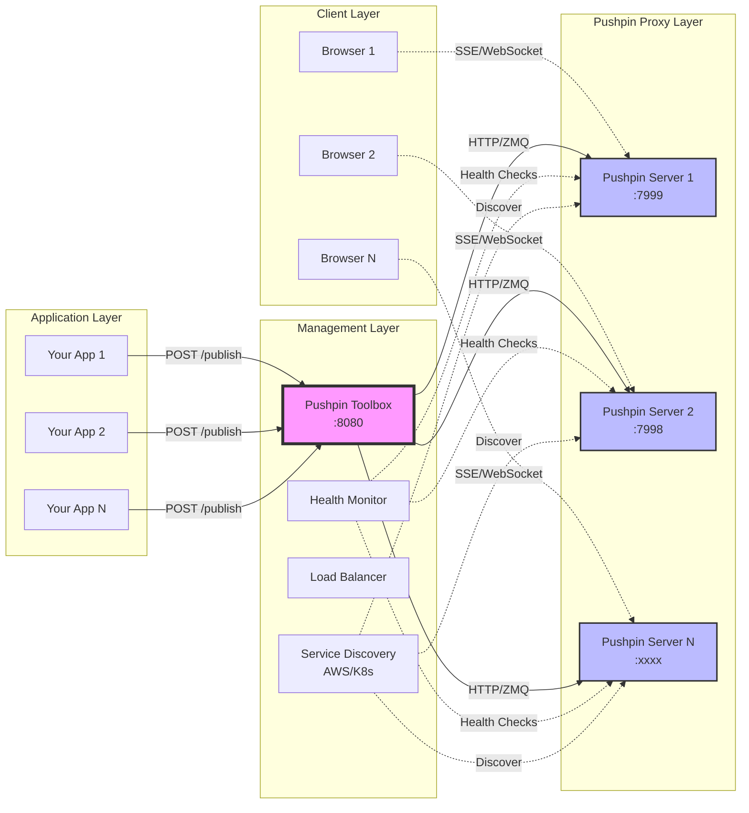
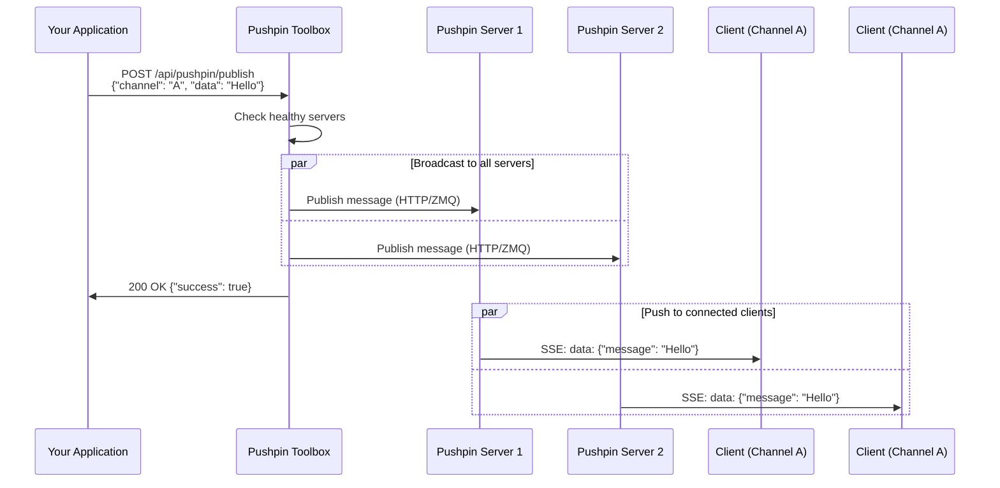

# Pushpin Missing Toolbox

A Spring Boot application that simplifies managing multiple [Pushpin](https://pushpin.org/) servers for scalable realtime web applications. It provides load balancing, health monitoring, and a unified API for publishing messages across your Pushpin infrastructure.

## 🚀 TL;DR

- **What**: A management layer for Pushpin servers that adds load balancing, health checks, and security
- **Why**: Pushpin handles realtime connections, this toolbox manages multiple Pushpin instances
- **How**: REST API to publish messages, automatic routing to healthy servers
- **Quick Start**: `docker-compose up -d && ./gradlew bootRun` - You're live in 2 minutes!

## Why Pushpin? Why This Toolbox?

### The Problem

Building realtime web applications (chat, live dashboards, notifications) traditionally requires:
- Managing long-lived WebSocket/SSE connections
- Handling connection state and reconnections
- Scaling horizontally while maintaining message delivery
- Complex backend code for connection management

### What Pushpin Solves

[Pushpin](https://pushpin.org/) is a reverse proxy that handles the complexity of realtime connections:
- **Holds client connections** - Your backend stays stateless
- **Protocol translation** - HTTP requests become WebSocket/SSE messages
- **Horizontal scaling** - Clients stay connected even as backends scale
- **GRIP protocol** - Simple HTTP-based publishing

### Why You Need This Toolbox

While Pushpin is powerful, managing multiple Pushpin instances in production requires:
- **Distributing messages** to all Pushpin servers
- **Health monitoring** to route around failures
- **Service discovery** for dynamic environments (AWS, Kubernetes)
- **Security** - Authentication, rate limiting, encryption
- **Unified API** - Single endpoint for all your Pushpin servers
- **Example** - Serves as a reference implementation for building the support into your applications

**This toolbox provides all of these features out of the box.**

### Real-World Use Cases

1. **Live Dashboards** - Push metrics to thousands of users without managing connections
2. **Chat Applications** - Scale horizontally while maintaining message delivery
3. **Collaborative Editing** - Real-time document updates across users
4. **IoT Data Streaming** - Push sensor data to monitoring dashboards
5. **Live Notifications** - System alerts, order updates, social media notifications
6. **Sports/Trading Platforms** - Live scores, price updates to millions of users

## Architecture



### Message Flow



All of this can also be easily accomplished directly within your application code by using the libraries that the server is built on, but this toolbox provides a ready-to-use solution that handles the complexity of managing multiple Pushpin servers.

**Key Benefits:**
- **Stateless Applications** - Just POST messages, no connection management
- **Automatic Failover** - Health monitoring routes around failed servers
- **Horizontal Scaling** - Add more Pushpin servers as needed
- **Unified API** - Single endpoint for all publishing needs
- **Service Discovery** - Automatically find Pushpin servers in AWS/Kubernetes

## Quick Start (2 Minutes)

### Prerequisites
- Docker & Docker Compose
- Java 17+

### 1. Clone and Start Everything

```bash
# Clone the repository
git clone https://github.com/mpecan/pushpin-missing-toolbox.git
cd pushpin-missing-toolbox

# Start Pushpin servers and the toolbox
docker-compose up -d

# Wait for services to be ready
sleep 10
```

### 2. Test - Send Your First Message

```bash
# Publish a message
curl -X POST http://localhost:8080/api/pushpin/publish \
  -H "Content-Type: application/json" \
  -d '{
    "channel": "test-channel",
    "data": {"message": "Hello, Realtime World!"}
  }'
```

### 3. Test - Receive Messages in Real-Time

Open a new terminal and subscribe to the channel:

```bash
# Subscribe to receive messages (SSE)
curl -N http://localhost:7999/api/events/test-channel
```

Now send another message from the first terminal - you'll see it appear instantly!

### That's It! 🎉

You now have:
- 2 Pushpin servers running (ports 7999, 7998)
- Pushpin Toolbox managing them (port 8080)
- Automatic health monitoring and load balancing
- A working realtime messaging system

### What Just Happened?

1. **docker-compose** started 2 Pushpin servers and configured them
2. Your message was sent to the Toolbox
3. Toolbox distributed it to all Pushpin servers
4. Pushpin pushed it to all connected clients instantly

### Next Steps

- Try the [Full Installation Guide](#installation) for production setup
- See [Configuration](#configuration) for customization
- Check [Examples](#examples) for real-world use cases

## API Reference

### Core Endpoints

#### Publish Message

```http
POST /api/pushpin/publish
Content-Type: application/json

{
  "channel": "string",
  "data": "object",
  "eventType": "string (optional)",
  "id": "string (optional)",
  "prevId": "string (optional)"
}
```

**Response:**
```json
{
  "success": true,
  "message": "Message published successfully",
  "timestamp": "2024-01-15T10:30:00.000Z"
}
```

**Error Response:**
```json
{
  "success": false,
  "message": "Failed to publish message",
  "error": "No healthy servers available",
  "timestamp": "2024-01-15T10:30:00.000Z"
}
```

**Status Codes:**
- `200 OK` - Message published successfully
- `400 Bad Request` - Invalid request body
- `401 Unauthorized` - Authentication required
- `429 Too Many Requests` - Rate limit exceeded
- `500 Internal Server Error` - Server error

#### Publish to Specific Channel

```http
POST /api/pushpin/publish/{channel}
Content-Type: application/json

{
  "message": "Hello, World!",
  "any": "other fields"
}
```

Query Parameters:
- `event` (optional) - Event type for SSE

#### Subscribe to Channel (SSE)

```http
GET /api/events/{channel}
Accept: text/event-stream
```

**Response:** Server-Sent Events stream
```
data: {"message": "Connected to channel"}

event: custom-event
data: {"type": "notification", "content": "New message"}

data: {"message": "Hello, World!"}
```

### Server Management

#### List All Servers

```http
GET /api/pushpin/servers
```

**Response:**
```json
[
  {
    "id": "pushpin-1",
    "host": "pushpin-1",
    "port": 7999,
    "controlPort": 5564,
    "publishPort": 5560,
    "active": true,
    "weight": 100,
    "healthCheckPath": "/status"
  }
]
```

#### List Healthy Servers

```http
GET /api/pushpin/servers/healthy
```

#### Get Server by ID

```http
GET /api/pushpin/servers/{id}
```

### Monitoring Endpoints

#### Metrics Summary

```http
GET /api/metrics/summary
```

**Response:**
```json
{
  "messages": {
    "sent": 1500,
    "received": 1200,
    "errors": 5,
    "errorRate": 0.33
  },
  "servers": {
    "pushpin-1": {
      "healthy": true,
      "host": "pushpin-1",
      "port": 7999
    }
  },
  "activeConnections": {
    "websocket": 45,
    "sse": 120
  }
}
```

### Authentication Headers

When authentication is enabled:

**Token-based:**
```http
X-Pushpin-Auth: your-secret-token
```

**JWT:**
```http
Authorization: Bearer your.jwt.token
```

**HMAC (Server-to-Server):**
```http
X-Pushpin-Signature: hmac-sha256-signature
X-Pushpin-Timestamp: 1705316400000
```

## Installation

### Docker Compose (Recommended)

The fastest way to get started is with the included `docker-compose.yml`:

```bash
# Start everything (Pushpin servers + Toolbox)
docker-compose up -d

# Check logs
docker-compose logs -f

# Stop everything
docker-compose down
```

### Standalone JAR

For production deployments:

```bash
# Build the JAR
./gradlew bootJar

# Run with external configuration
java -jar server/build/libs/pushpin-missing-toolbox-*.jar \
  --spring.config.location=./application-prod.properties
```

### Kubernetes

See [deployment/kubernetes/](deployment/kubernetes/) for Helm charts and manifests.

### AWS ECS/Fargate

See [deployment/aws/](deployment/aws/) for CloudFormation templates.

## Configuration

### Minimal Configuration

For a basic setup with 2 local Pushpin servers:

```properties
# application.properties
server.port=8080

# Pushpin servers
pushpin.servers[0].id=pushpin-1
pushpin.servers[0].host=localhost
pushpin.servers[0].port=7999

pushpin.servers[1].id=pushpin-2
pushpin.servers[1].host=localhost
pushpin.servers[1].port=7998

# Enable health checks
pushpin.healthCheckEnabled=true
```

### Common Configurations

#### Single Server
```properties
pushpin.servers[0].id=pushpin-main
pushpin.servers[0].host=pushpin.example.com
pushpin.servers[0].port=7999
```

#### With Authentication
```properties
# Enable token auth
pushpin.authEnabled=true
pushpin.authSecret=your-secret-key

# OR enable JWT
pushpin.security.jwt.enabled=true
pushpin.security.jwt.provider=symmetric
pushpin.security.jwt.secret=your-256-bit-secret-key
```

#### With AWS Discovery
```properties
pushpin.discovery.enabled=true
pushpin.discovery.aws.enabled=true
pushpin.discovery.aws.region=us-east-1
pushpin.discovery.aws.tags.service=pushpin
```

### Full Configuration

For all available options, see [docs/Configuration.md](docs/Configuration.md) or check the fully documented [application.properties](server/src/main/resources/application.properties).

## Examples

### Live Dashboard

Create a real-time dashboard that updates all connected clients:

```javascript
// Client-side: Subscribe to metrics
const eventSource = new EventSource('/api/events/metrics');

eventSource.onmessage = (event) => {
  const metrics = JSON.parse(event.data);
  updateDashboard(metrics);
};

// Server-side: Publish metrics every second
setInterval(() => {
  fetch('http://localhost:8080/api/pushpin/publish/metrics', {
    method: 'POST',
    headers: { 'Content-Type': 'application/json' },
    body: JSON.stringify({
      cpu: getCpuUsage(),
      memory: getMemoryUsage(),
      requests: getRequestCount()
    })
  });
}, 1000);
```

### Chat Application

Simple chat room with user presence:

```javascript
// Join chat
fetch('/api/pushpin/publish/chat?event=user-joined', {
  method: 'POST',
  body: JSON.stringify({ user: 'Alice', timestamp: new Date() })
});

// Send message
fetch('/api/pushpin/publish/chat?event=message', {
  method: 'POST',
  body: JSON.stringify({ 
    user: 'Alice', 
    message: 'Hello everyone!',
    timestamp: new Date()
  })
});

// Client receives typed events
eventSource.addEventListener('user-joined', (e) => {
  showNotification(`${JSON.parse(e.data).user} joined`);
});

eventSource.addEventListener('message', (e) => {
  displayMessage(JSON.parse(e.data));
});
```

### IoT Sensor Streaming

Stream sensor data to monitoring dashboards:

```python
import requests
import json
from datetime import datetime

# Sensor publishes readings
def publish_sensor_data(sensor_id, temperature, humidity):
    requests.post(
        'http://localhost:8080/api/pushpin/publish',
        json={
            'channel': f'sensors/{sensor_id}',
            'data': {
                'temperature': temperature,
                'humidity': humidity,
                'timestamp': datetime.now().isoformat()
            },
            'id': str(uuid.uuid4()),  # For message ordering
            'prevId': last_message_id
        }
    )
```

For more examples, see [docs/Examples.md](docs/Examples.md).

## Project Structure

- `server/` - Main Spring Boot application
  - `src/main/kotlin/io/github/mpecan/pmt/model` - Data models
  - `src/main/kotlin/io/github/mpecan/pmt/config` - Configuration classes
  - `src/main/kotlin/io/github/mpecan/pmt/service` - Services for managing Pushpin servers
  - `src/main/kotlin/io/github/mpecan/pmt/controller` - REST controllers
  - `src/main/kotlin/io/github/mpecan/pmt/security` - Security components
  - `src/main/kotlin/io/github/mpecan/pmt/health` - Health check components
- `discovery/` - Core discovery interfaces and configuration-based implementation
- `discovery-aws/` - AWS EC2 and Auto Scaling Group discovery module
- `discovery-kubernetes/` - Kubernetes pod and service discovery module
- `pushpin-api/` - GRIP protocol implementation library
- `pushpin-client/` - Client library for publishing messages to Pushpin

## Development

### Building

```bash
./gradlew build
```

### Running Tests

```bash
./gradlew test
```

### Running Locally

```bash
# With Docker Compose (includes Pushpin servers)
docker-compose up -d

# Or standalone (requires external Pushpin servers)
./gradlew bootRun
```

## Documentation

- [API Reference](docs/API.md) - Complete API documentation
- [Configuration Guide](docs/Configuration.md) - All configuration options
- [Testing Guide](docs/Testing.md) - Integration testing with Testcontainers
- [Examples](docs/Examples.md) - Real-world usage examples
- [AWS Discovery](pushpin-discovery-aws/README.md) - AWS integration guide
- [Kubernetes Discovery](pushpin-discovery-kubernetes/README.md) - K8s integration guide

## Contributing

Contributions are welcome! Please read our [Contributing Guide](CONTRIBUTING.md) for details.

## License

This project is licensed under the MIT License - see the [LICENSE](LICENSE) file for details.
